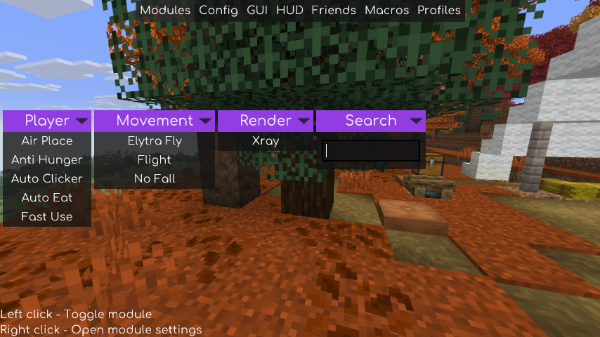
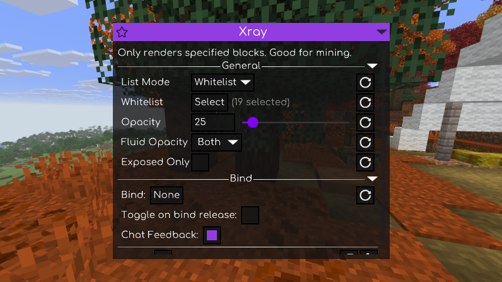

# Vesper Client

[](https://github.com/TimonNL2/Minecraft-client/actions/workflows/build.yml)
[](https://github.com/TimonNL2/Minecraft-client/releases)

A standalone Fabric client for **Minecraft Java 26.2 and 26.3**, with Meteor's original interface and nine available modules:

**Flight · Elytra Fly · Fast Use · Auto Clicker · Xray · Auto Eat · Anti Hunger · No Fall · Air Place**

**Minecraft 26.3 additionally includes Storage ESP and Auto Fish (11 modules total).** Minecraft 26.2 keeps the nine modules above. Storage ESP highlights storage blocks with configurable colors and rendering options. Auto Fish automatically casts and reels in a fishing rod, with configurable delays and rod protection.

**[Download](https://github.com/TimonNL2/Minecraft-client/releases/latest)** · **[Installation](docs/INSTALLATION.md)** · **[All builds](https://github.com/TimonNL2/Minecraft-client/releases)** · **[Changelog](CHANGELOG.md)**

Vesper is a modified [Meteor Client](https://github.com/MeteorDevelopment/meteor-client) distribution under GPL-3.0. Meteor is included: do not install a separate Meteor jar. See [attribution and source](NOTICE.md).



## Choose your download

New releases target **Minecraft 26.3 only**. For Minecraft 26.2, use the unchanged [2.0.1 release](https://github.com/TimonNL2/Minecraft-client/releases/tag/v2.0.1).

| Minecraft | Download | Requirements |
|---|---|---|
| 26.2 | `vesper-client-2.0.1-mc26.2.jar` | Java 25, Fabric Loader 0.19.5+, Fabric API 0.161.0+26.2 |
| 26.3 | `vesper-client-2.0.2-mc26.3.jar` | Java 25, Fabric Loader 0.19.5+, Fabric API 0.161.0+26.3 |

Download the **normal jar**, not `-sources.jar`. Use only the version matching your Minecraft profile. Remove older Timon/Vesper jars and the regular Meteor jar. Follow the [installation guide](docs/INSTALLATION.md).

**Right Shift** opens the menu. Left-click a module to toggle it; right-click to open its settings. **F8** disables all modules. Draggable windows, colors, fonts, scale, search, favorites, profiles and keybind editing use Meteor's original interface.

Vesper adds no client credit overlay, promotional splash text or client links to Minecraft's main menu. Extra account/proxy controls are also removed from the multiplayer menu. Credits remain in the mod metadata, license and source notices.

## Modules and settings

| Module | Available settings |
|---|---|
| Flight | Abilities/Velocity, movement and vertical speed, No Sneak, anti-kick None/Normal/Packet, interval and duration. |
| Elytra Fly | Vanilla/Packet/Pitch40/Bounce, movement and vertical speed, automatic takeoff, acceleration, auto-hover, water/chunk/collision checks, pitch/yaw, elytra swapping, firework replenishment and autopilot. |
| Fast Use | All/Some, item list, block filter and cooldown in ticks. |
| Auto Clicker | Separate left/right Disabled/Hold/Press modes, delays and clicking in screens. |
| Xray | **Whitelist or blacklist**, separately saved block lists, opacity 0–255, fluid selection and Exposed Only. |
| Auto Eat | Food blacklist, inventory search, food priority, health/hunger thresholds and combinations. Original pause options are retained. |
| Anti Hunger | Separate sprint-packet and on-ground settings. |
| No Fall | Packet/Place/AirPlace, placement item, timing, centering, Anti Bounce and mace pause. |
| Air Place | Normal/custom range, placement preview, Shape Mode and line/face colors. |

The module code and settings come from the pinned Meteor versions in [NOTICE.md](NOTICE.md). Behavior may differ from future Meteor versions. Options referring to optional external mods require those mods.

Under **Xray → List Mode → Whitelist**, selected blocks remain visible. Under **Blacklist**, selected blocks receive the configured opacity. **Opacity** controls how visible hidden/excluded blocks remain. The block selector supports searching by name and ID.



## Survival and compatibility

The client uses no OP commands and requires no server permissions. Eating, elytra flight and block placement require real inventory items. Servers can validate movement, damage, hunger and placement; Flight, No Fall, Anti Hunger and Air Place remain server-dependent. Server Anti-Xray can hide block information the client never receives. Fast Use does not shorten server-controlled eating times or cooldowns.

**2.0.1 fixes the world-join crash with Sodium 0.9.3-alpha.1 on Minecraft 26.3.** The fluid hook uses a method shared with Sodium 0.9.1 and 0.9.2. Automated tests cover vanilla/Indigo and the pinned Sodium version for each target. See [test scope and results](verification/TESTING.md) for exact combinations and limitations.

## Every build on GitHub

- A push to **main** builds Minecraft 26.3 and runs client tests with **vanilla and Sodium**. After all checks pass, a separate **development release** `build-<number>` includes the Minecraft 26.3 jar, matching source jars, complete buildable source, instructions and SHA-256 checksums.
- A **`v2.0.1`** tag, or a later version tag, publishes a regular release. It must match `mod_version` in `gradle.properties`.
- Pull requests are built and tested; downloads are under **Actions → Artifacts**. Failed builds are not published as releases.
- Jar artifacts are retained for 90 days and test artifacts for 30 days. Published releases remain available until removed. Local builds are published after their source is pushed to GitHub.

Manual builds: **Actions → Build and publish client → Run workflow**. Publishing uses GitHub's temporary `GITHUB_TOKEN`; no personal token needs to be stored as a repository secret.

## Build from source

Install **JDK 25** and set `JAVA_HOME`. The wrapper downloads Gradle 9.6.0 and verifies its pinned checksum.

```powershell
# Windows: Minecraft 26.3
.\build-all.ps1
# Include client tests with vanilla and Sodium
.\build-all.ps1 -GameTests
# One version
.\gradlew.bat -Pminecraft_version=26.3 collectRelease
```

```sh
# Linux/macOS
./gradlew -Pminecraft_version=26.3 collectRelease
# Linux without a display, with Xvfb and Mesa installed
xvfb-run -a ./gradlew -Pminecraft_version=26.3 -Ptest_renderer=sodium runClientGameTest
```

Jars are written to `dist/`. Tests use `build/run/clientGameTest`, separate from launcher profiles and saved worlds. `test_renderer` accepts `vanilla` (default) or `sodium`. Sodium is not bundled with Vesper.

## Project layout

- `src/main`: shared Meteor source with Vesper changes.
- `src/mc26.3`: changed files for 26.3, replacing their common counterparts during building.
- `src/gametest`: integration tests and isolated helpers; excluded from the mod jar.
- `gradle/`, `gradlew`, `gradlew.bat`: Gradle wrapper.
- `.github/workflows/build.yml`: builds, tests and release publishing.
- `docs/`, `CHANGELOG.md`, `NOTICE.md`, `LICENSE`, `licenses/`: instructions, history and attribution.

Supporting Meteor classes remain internally for shared rendering and movement hooks. Only the nine listed modules are visible, saved and allowed to activate. The configuration directory retains its original name, `timon-client`, to preserve 2.0.0 settings. Vesper was previously named Timon Client; the independent first implementation remains at **v1.0.0**.
